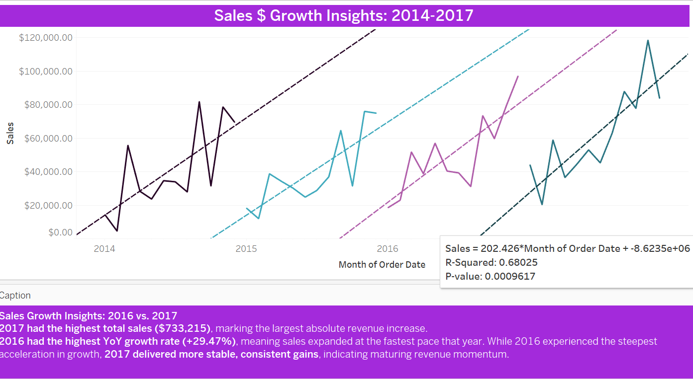
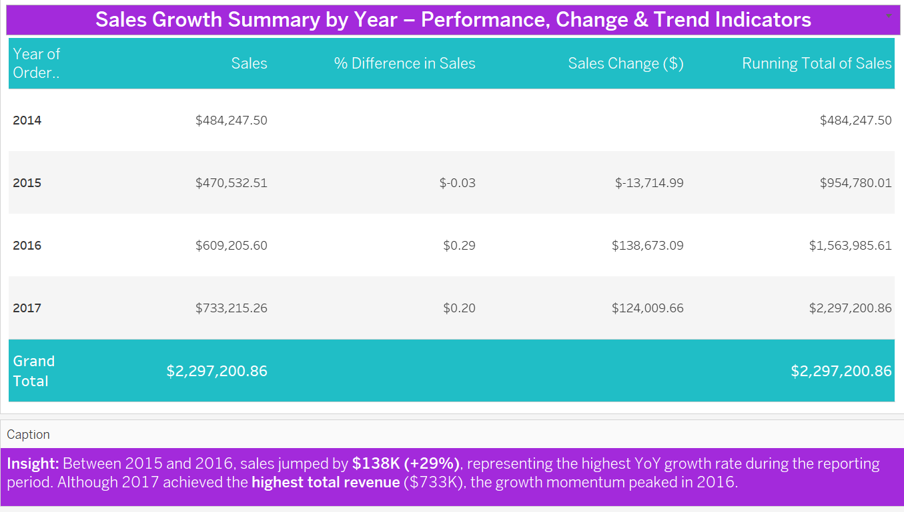
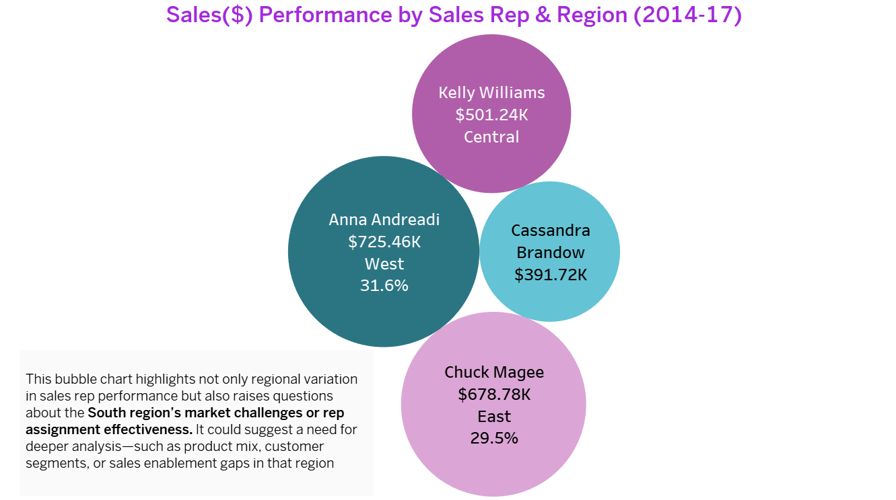
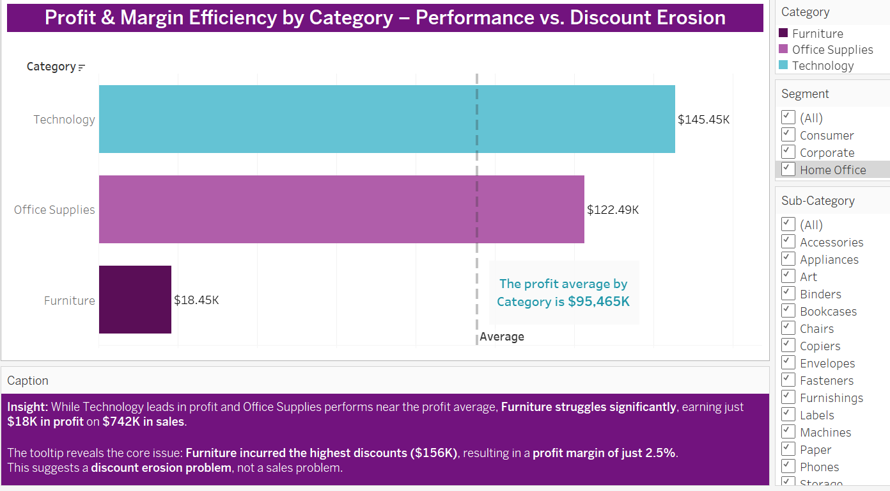
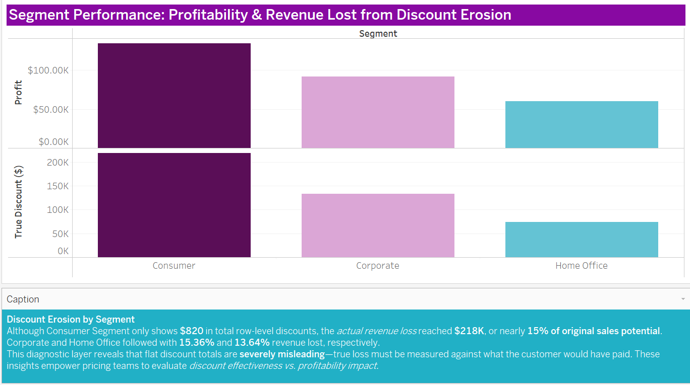
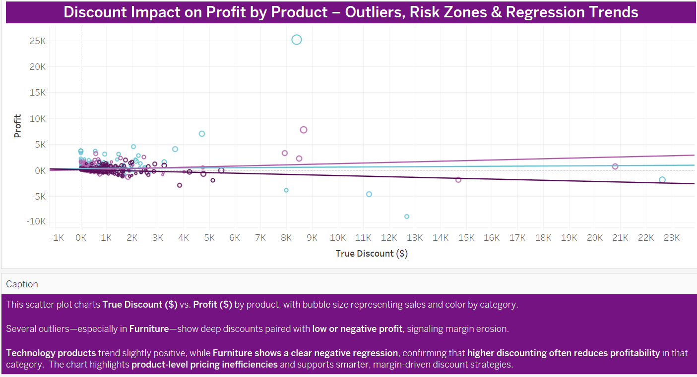
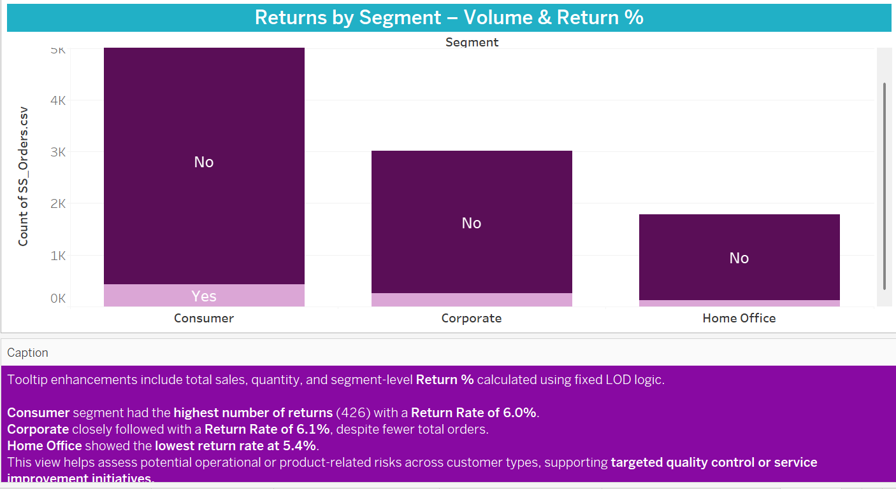
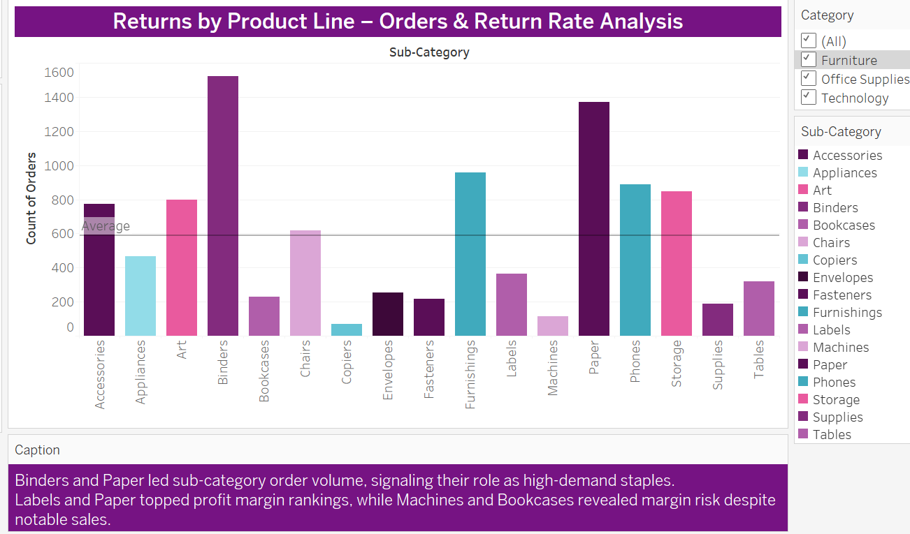

  

# Superstore BI Analytics – Executive Business Intelligence Report: Portfolio Summary Review

> 🟢 **Looking for the strategic rationale behind this analysis?**  
> Explore the companion document: [Why This Analysis Is Different](/Why_This_Analysis_Is_Different.md)

---

## Project Theme and Scope
**The Discounting Dilemma: Margin Erosion, Profit Risk & Returns in Superstore Sales**

---

## 🟦 Executive Summary

Through the strategic application of segmentation and regression modeling, complemented by insightful visual analytics, this project delivers a clear diagnosis of Superstore's profitability challenges. 

The analysis pinpoints patterns of over-discounting, unprofitable product lines, and regional margin inconsistencies with each key finding directly informing actionable recommendations designed to guide decision-makers toward improved performance.

---

### 🟪 Navigating Margin Challenges: A Strategic BI Intelligence Framework

This executive report encapsulates a comprehensive BI intelligence engagement directly addressing core business problems around margin erosion, profitability risk, and operational inefficiency. It demonstrates a consultant’s approach: from identifying key business imperatives and formulating incisive questions, to delivering actionable, data-validated strategic recommendations. 

Executives, BI leaders, and hiring managers will gain insight into a consultant’s ability to guide the full value chain from business problem to strategic resolution through clear narrative, technical fluency, and applied decision intelligence.

---

## 🟩 Introduction

This report presents a curated portfolio of business intelligence insights developed to diagnose and address core performance challenges within Superstore’s sales and profitability data. Designed as both a strategic engagement and executive-facing deliverable, the analysis offers a comprehensive review of business patterns across 18 visual perspectives emphasizing clarity, analytical depth, and real-world applicability.

The project reflects the full arc of applied BI practice: from framing the business problem and defining strategic questions, to delivering performance-aligned insights supported by actionable recommendations. Each section is structured to guide decision-makers from discovery to decision, highlighting opportunities for targeted action across pricing, margin protection, product performance, and return behavior.

---

## 🟦 Business Problem

Despite steady sales growth from 2014 to 2017, Superstore faces persistent margin pressure and declining profitability driven by:

- Over-discounting across consumer segments  
- High product return rates concentrated in specific sub-categories  
- Underperforming high-cost products (e.g., Machines, Bookcases)  
- Misalignment between high sales volume and actual contribution margin  

---

## 🟪 Business Questions

- Which products, segments, and regions contribute most (and least) to profitability?
- Where are discounting practices undermining margin health?
- Which return behaviors present operational and financial risk?
- How can the business apply smarter segmentation to improve pricing and strategy?
- What does the Home Office segment’s use of Same Day shipping reveal about urgency, and how can AI-driven analysis of this behavior unlock high-margin fulfillment opportunities and targeted premium service tiers?

---
---

## 🟩 Insight Spotlight – Profit Performance by Ship Mode
🔗 Companion Insight: [Profit_Performance_Matrix_ShipMode.md](/docs/Insights/Ship_Mode_Insight.md)

** 🟣 Behavioral Cue:**  
The high profit margin from Same Day shipping to Home Office customers may reflect urgent, business-critical purchase behavior; such as restocking office supplies like **Paper, Envelopes or Labels**, which previously showed high margin efficiency.
[Sales by Category & Subcategory: Paper](Assets/Sales_by_Category_SubCategory_PaperTT.png)

This suggests that while Same Day isn’t a volume driver, it plays a vital role in **margin optimization for time-sensitive, high-utility items**.

** 🔵 Strategic Opportunity:**  
Develop a **premium fulfillment tier** focused on high-margin, high-urgency products for professional or remote office consumers.

---

### 🔗 Supporting Visual Evidence – High Margin Office Supplies  
These sub-category breakdowns validate the earlier insight, revealing consistent high profit margin performance from office supply staples frequently linked to time-sensitive replenishment behaviors:

- 📄 [Sales by Category & Sub-Category: **Paper**](/Assets/Sales_by_Category_SubCategory_PaperTT.png)  
- 📄 [Sales by Category & Sub-Category: **Labels**](/Assets/Sales_by_Category_SubCategory_LabelsTT.png)  
- 📄 [Sales by Category & Sub-Category: **Envelopes**](/Assets/Sales_by_Category_SubCategory_EnvelopesTT.png)

---

## 🟢 Key Visual Narratives & Insights

Each section below features representative visuals from the full dashboard, linked to `.md` insight and strategy files for deeper analysis.

---

### 🔹 1. Sales Growth & Trend Validation (2014–2017)

> Sales trends from 2014–2017 showed a clear upward trajectory.  
> **Trend lines with statistically significant R² values** confirmed the strength of the growth pattern, particularly in 2017 where year-over-year growth reached its peak.

🗂 Insight: [`Sales Growth Trends Insight →`](Strategic_Recommendations/Sales_Growth_Trends_Strategy.md)

---

### 🔹 2. Sales Rep & Regional Performance

  

> Some reps achieved high revenue but delivered low or negative margins. Regional disparities in performance suggest strategy misalignment or inconsistent discounting practices.

🗂 Insight: [`Sales Rep & Regional Performance Insight →`](docs/Insights/Sales_rep_Regional_Performance.md)

---

### 🔹 3. Category & Sub-Category Profitability

> Sub-category analysis revealed Bookcases and Machines to be among the lowest margin contributors, with Machines producing just **1.8% profit margin** and a **17.5% return rate**.

🗂 Insight: [`Profit Margin Efficiency Insight →`](docs/Insights/Profit_Margin_Efficiency_By_Category.md)

---

### 🔹 4. Discounting & Margin Erosion

  

> The scatterplot reveals deep discounting on some of the **least profitable products**.  
> Segment-level analysis showed **Consumer discounts totaled $218K** with over **$300K in revenue loss.**

🟣 Insight: [`Segment Discount Analysis →`](docs/Insights/Segment_Discount_Analysis.md)  
🟢 Strategy: [`Segment Discount Strategy →`](Strategic_Recommendations/Segment_Discount_Strategy.md)

---

### 🔹 5. Returns Behavior by Segment & Product Line

  

> Return behavior was most concentrated in **Office Supplies and Technology**.  
> Machines (Technology) had a **17.5% return rate**, while categories like Labels and Envelopes had low return volumes but high margins.

🟣 Insight: [`Returns by Product Line →`](docs/Insights/Returns_By_Product_Line_Insight.md)  
🟢 Strategy: [`Returns Strategy Recommendation →`](Strategic_Recommendations/Returns_By_Product_Line_Strategy.md)

---

## 🟦 Tools & Techniques Used

> **BI techniques included:**  
> - Year-over-Year (YoY) growth modeling  
> - Regression overlay analysis for sales trends  
> - Profit margin divergence mapping  
> - Discount vs. Profit correlation scatterplots  
> - Level of Detail (LOD) calculations for Return %  
> - Data segmentation by Segment, Region, Product Line, Sales Rep

---

## 🟪 Key Findings

- **Machines & Bookcases** are consistent margin liabilities.
- **Labels, Envelopes, Paper** were small-volume, high-margin wins.
- **Consumer segment** drove highest sales but incurred highest discount loss.
- **Phones & Copiers** delivered high sales with margin risk exposure.
- **Return behavior is concentrated**, and unmanaged, risks eroding margin gains.

---

## 🟩 Strategic Recommendations Summary

- 🟣 **Margin Guardrails** to prevent excessive discounting  
- 🟢 **SKU Rationalization** for underperforming products  
- 🔵 **Sales Incentives Realignment** to reward margin, not just revenue  
- 🟡 **AI Optimization Models** for pricing and return forecasting  
- 🟠  **A/B Testing of Discount-Free Campaigns**

🟦 Strategy Files:
- [`Profit Margin Efficiency Strategy →`](Strategic_Recommendations/Profit_Margin_Efficiency_Strategy.md)  
- [`Segment Discount Strategy →`](Strategic_Recommendations/Segment_Discount_Strategy.md)  
- [`Returns by Product Line Strategy →`](Strategic_Recommendations/Returns_By_Product_Line_Strategy.md)

---

## 🟪 AI-Driven Strategy Opportunities

- Use AI for **price elasticity modeling** and **promotion optimization**  
- Apply regression-informed forecasting for sales performance  
- Implement return risk scoring based on product, region, and margin

---

## 🟩 Potential Business Benefits

- Increased contribution margin from smarter discounting  
- Lower operational costs from reduced returns  
- Stronger sales team alignment to profit—not just volume

---

## 🟨 Risks of Inaction

- Ongoing margin loss despite growing revenue  
- Operational waste from high-return, low-margin product lines  
- Poor customer experience from pricing inconsistency

---

## 🟪 Limitations & Data Constraints

- No COGS or inventory/sourcing data available  
- Vague product categories (e.g., “Machines”)  
- No breakdown of return reasons or fees  
- Discount metadata not linked to campaign/channel origin

---

## 🟦 Future Analysis Opportunities

- Add **COGS** or supplier-side data for net margin modeling  
- Incorporate **return reasons** or NLP-based comment analysis  
- Create **product hierarchy refinement** for category clarity  
- Explore **sales velocity vs. margin efficiency** overlays

---

## 🔗 Repository Navigation & Visual Access

- 📂 [All Insight Files →](docs/Insights)  
- 📂 [All Strategic Recommendations →](Strategic_Recommendations)  
- 📊 [Interactive Tableau Storyboard →](#)

---

> 🟣 This document presents a holistic view of Superstore’s business performance, emphasizing strategic BI analysis, data-informed storytelling, and margin protection initiatives.

