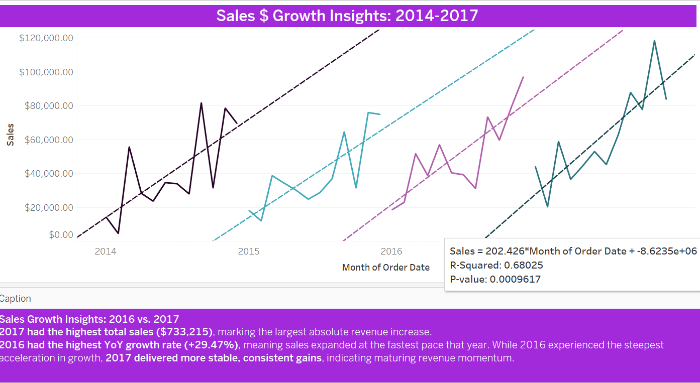
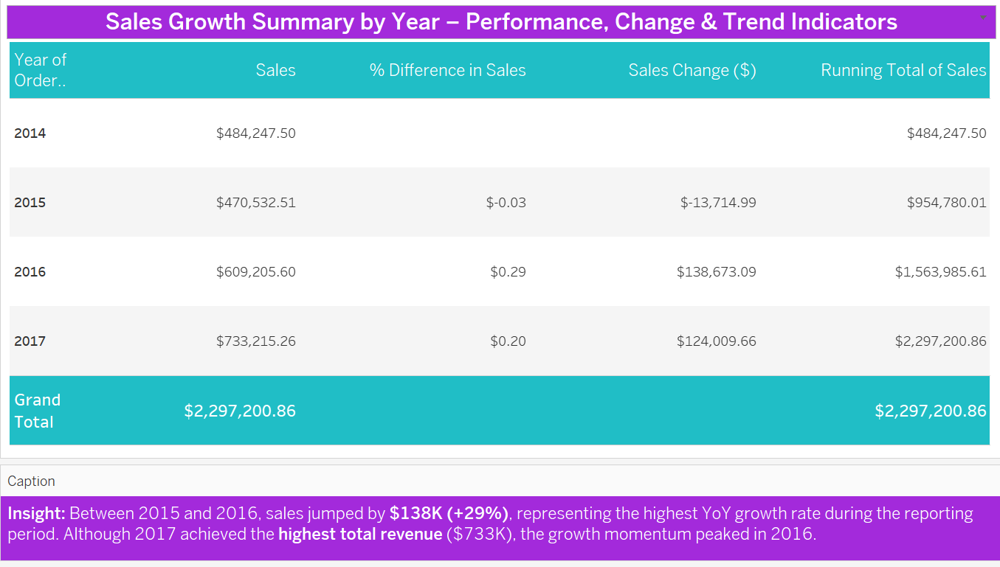
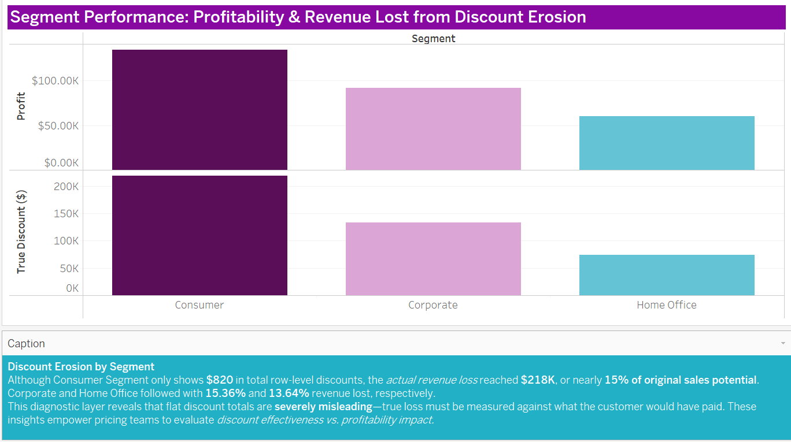
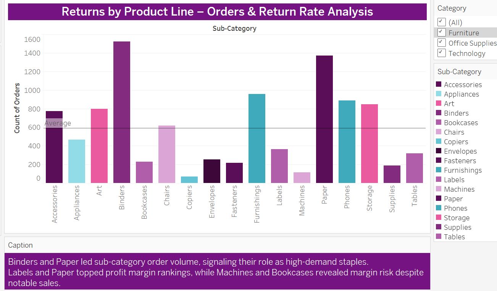

# Superstore BI Analytics – Executive Intelligence Summary

## Project Theme and Scope
**The Discounting Dilemma: Margin Erosion, Profit Risk & Returns in Superstore Sales**

---

## 📄 Executive Summary

This project presents a strategic-level diagnostic of Superstore’s sales performance from 2014–2017, with a sharp focus on profitability erosion, discount behavior, and return risks. Rebuilt in under five days following the loss of a Tableau source file, the analysis spans 17+ visual insights and connects data exploration to real-world business strategy.

Using segmentation, regression modeling, and visual analytics, the project uncovers patterns of over-discounting, unprofitable product lines, and regional margin inconsistencies. Each key finding is linked to a supporting insight narrative and recommendation, offering decision-makers a complete view of both performance gaps and actionable paths forward.

This README summarizes the full BI intelligence journey: from business problem to data-backed recommendation. It is designed for executives, BI leaders, and hiring managers seeking clear storytelling, technical fluency, and data-aligned strategy — all in one place.

---

This executive briefing distills key findings and strategic recommendations from a Business Inelligene Analysis and Visualization story across 18 Superstore Performance perspectives focused on margin erosion, excessive discounting, and segment-specific return behaviors. The project serves as a model of applied business intelligence, profit risk diagnostics, and data-driven strategy layering and storytelling.

---

## 🟦 Business Problem

Despite steady sales growth from 2014 to 2017, Superstore faces persistent margin pressure and declining profitability driven by:

- Over-discounting across consumer segments  
- High product return rates concentrated in specific sub-categories  
- Underperforming high-cost products (e.g., Machines, Bookcases)  
- Misalignment between high sales volume and actual contribution margin  

---

## 🟪 Business Questions

- Which products, segments, and regions contribute most (and least) to profitability?
- Where are discounting practices undermining margin health?
- Which return behaviors present operational and financial risk?
- How can the business apply smarter segmentation to improve pricing and strategy?

---

## 📈 Key Visual Narratives & Insights

Each section below features representative visuals from the full dashboard, linked to `.md` insight and strategy files for deeper analysis.

---

### 🔹 1. Sales Growth & Trend Validation (2014–2017)

> Sales trends from 2014–2017 showed a clear upward trajectory.  
> **Trend lines with statistically significant R² values** confirmed the strength of the growth pattern, particularly in 2017 where year-over-year growth reached its peak.

🗂 Insight: [`Sales Growth Trends Insight →`](Strategic_Recommendations/Sales_Growth_Trends_Strategy.md)

---

### 🔹 2. Sales Rep & Regional Performance

  

> Some reps achieved high revenue but delivered low or negative margins. Regional disparities in performance suggest strategy misalignment or inconsistent discounting practices.

🗂 Insight: [`Sales Rep & Regional Performance Insight →`](docs/Insights/Sales_rep_Regional_Performance.md)

---

### 🔹 3. Category & Sub-Category Profitability

> Sub-category analysis revealed Bookcases and Machines to be among the lowest margin contributors, with Machines producing just **1.8% profit margin** and a **17.5% return rate**.

🗂 Insight: [`Profit Margin Efficiency Insight →`](docs/Insights/profit_margin_efficiency_insight.md)

---

### 🔹 4. Discounting & Margin Erosion

  

> The scatterplot reveals deep discounting on some of the **least profitable products**.  
> Segment-level analysis showed **Consumer discounts totaled $218K** with over **$300K in revenue loss.**

🗂 Insight: [`Segment Discount Analysis →`](docs/Insights/segment_discount_analysis.md)  
🧠 Strategy: [`Segment Discount Strategy →`](Strategic_Recommendations/Segment_Discount_Strategy.md)

---

### 🔹 5. Returns Behavior by Segment & Product Line

  

> Return behavior was most concentrated in **Office Supplies and Technology**.  
> Machines (Technology) had a **17.5% return rate**, while categories like Labels and Envelopes had low return volumes but high margins.

🗂 Insight: [`Returns by Product Line →`](docs/Insights/Returns_By_Product_Line_Insight.md)  
🧠 Strategy: [`Returns Strategy Recommendation →`](Strategic_Recommendations/Returns_By_Product_Line_Strategy.md)

---

## 🧠 Tools & Techniques Used

> **BI techniques included:**  
> - Year-over-Year (YoY) growth modeling  
> - Regression overlay analysis for sales trends  
> - Profit margin divergence mapping  
> - Discount vs. Profit correlation scatterplots  
> - Level of Detail (LOD) calculations for Return %  
> - Data segmentation by Segment, Region, Product Line, Sales Rep

---

## 🔍 Key Findings

- **Machines & Bookcases** are consistent margin liabilities.
- **Labels, Envelopes, Paper** were small-volume, high-margin wins.
- **Consumer segment** drove highest sales but incurred highest discount loss.
- **Phones & Copiers** delivered high sales with margin risk exposure.
- **Return behavior is concentrated**, and unmanaged, risks eroding margin gains.

---

## 🧩 Strategic Recommendations Summary

- 🔐 **Margin Guardrails** to prevent excessive discounting  
- 🧾 **SKU Rationalization** for underperforming products  
- 💸 **Sales Incentives Realignment** to reward margin, not just revenue  
- 🤖 **AI Optimization Models** for pricing and return forecasting  
- 🧪 **A/B Testing of Discount-Free Campaigns**

🧠 Strategy Files:
- [`Profit Margin Efficiency Strategy →`](Strategic_Recommendations/Profit_Margin_Efficiency_Strategy.md)  
- [`Segment Discount Strategy →`](Strategic_Recommendations/Segment_Discount_Strategy.md)  
- [`Returns by Product Line Strategy →`](Strategic_Recommendations/Returns_By_Product_Line_Strategy.md)

---

## 🤖 AI-Driven Strategy Opportunities

- Use AI for **price elasticity modeling** and **promotion optimization**  
- Apply regression-informed forecasting for sales performance  
- Implement return risk scoring based on product, region, and margin

---

## 💰 Potential Business Benefits

- Increased contribution margin from smarter discounting  
- Lower operational costs from reduced returns  
- Stronger sales team alignment to profit—not just volume

---

## ⚠️ Risks of Inaction

- Ongoing margin loss despite growing revenue  
- Operational waste from high-return, low-margin product lines  
- Poor customer experience from pricing inconsistency

---

## 📉 Limitations & Data Constraints

- No COGS or inventory/sourcing data available  
- Vague product categories (e.g., “Machines”)  
- No breakdown of return reasons or fees  
- Discount metadata not linked to campaign/channel origin

---

## 🔭 Future Analysis Opportunities

- Add **COGS** or supplier-side data for net margin modeling  
- Incorporate **return reasons** or NLP-based comment analysis  
- Create **product hierarchy refinement** for category clarity  
- Explore **sales velocity vs. margin efficiency** overlays

---

## 🔗 Repository Navigation & Visual Access

- 📂 [All Insight Files →](docs/Insights)  
- 📂 [All Strategic Recommendations →](Strategic_Recommendations)  
- 📊 [Interactive Tableau Storyboard →](#)

---

> 📘 This document presents a holistic view of Superstore’s business performance, emphasizing strategic BI analysis, data-informed storytelling, and margin protection initiatives.

