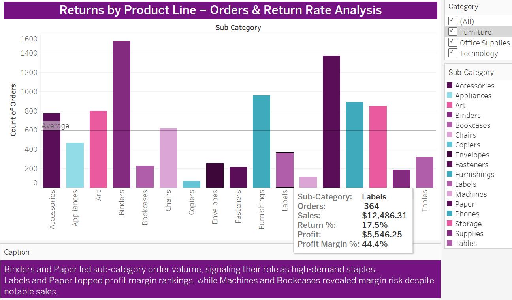
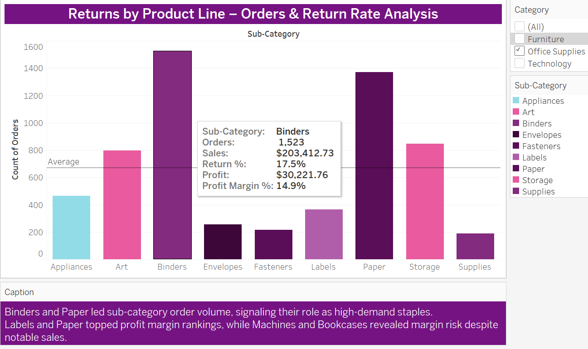

# Strategic Focus: Product Line Returns, Profitability & Risk Signals

This strategy brief identifies tactical opportunities and margin vulnerabilities across sub-categories, using return rates, order volume, and profit margin as a diagnostic lens.

---

## 🟦 Strategic Opportunities by Sub-Category

### 🟣 **Labels** – High Margin, Niche Volume
  
- **Profit Margin:** 44.4% | **Orders:** 364  
- **Strategy:** Consider cross-selling or bundling Labels with high-volume staples like Binders or Paper to boost exposure. Explore premium positioning due to strong margin resiliency.

---

### 📄 **Paper** – Dual Leader in Volume & Margin
  
- **Profit Margin:** 43.4% | **Orders:** 1,370  
- **Strategy:** Maintain core pricing while exploring value packs or loyalty discounts. Use Paper as a profitability anchor in margin-optimized product groupings.

---

### 🟩 **Binders** – High Demand with Moderate Margin
  
- **Profit Margin:** 14.9% | **Orders:** 1,523  
- **Strategy:** Monitor return behavior closely. Explore packaging redesigns or inventory rotation strategies to protect margins without compromising demand.

---

### 🟨 **Copiers** – Low Volume, High Profit Margin
  
- **Profit Margin:** 37.2% | **Orders:** 68  
- **Strategy:** Consider targeted marketing to niche buyers or premium sales support due to limited volume but high profitability. Focus on reducing return impact.

---

### 🟪 **Machines** – Margin Risk Product
  
- **Profit Margin:** 1.8% | **Orders:** 115  
- **Strategy:** Evaluate return reasons. Introduce stricter return policies, pricing recalibration, or warranty restructuring. If margin recovery is unfeasible, consider SKU rationalization.

---

### 🟦 **Bookcases** – Negative Margin Watchlist
  
- **Profit Margin:** -3.0% | **Orders:** 228  
- **Strategy:** Immediate review of discounting, shipping costs, or supplier terms. Investigate if bookcases are loss leaders or operationally inefficient.

---

### 🟩 **Phones** – High Sales, Margin Trade-Off
  
- **Profit Margin:** 13.5% | **Orders:** 889  
- **Strategy:** Ensure phones aren’t undercut by deep discounting or over-generous return terms. Balance aggressive sales targets with cost structure and fulfillment costs.

---

## 🟪 Cross-Category Strategy Themes

- **Profit Optimization:** Lean into high-margin sleepers (Labels, Envelopes) for low-risk profitability gains.  
- **Return Behavior Control:** For Machines and Bookcases, returns drive down margins — explore operational or packaging adjustments.  
- **Segmented Marketing:** Tailor strategies per product line — staple goods, premium lines, and underperformers each demand nuanced messaging and incentive structures.

---

**File Path:**  
📂 `/Strategic_Recommendations/returns_by_product_line_strategy.md`  
📸 Image references located in `/Assets/`
