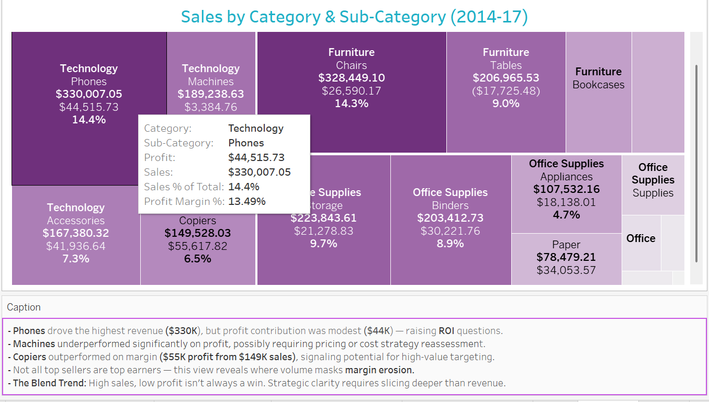
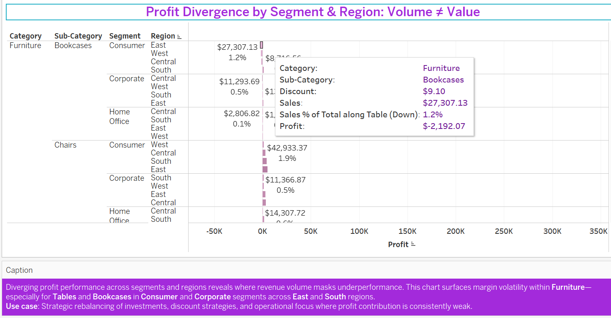
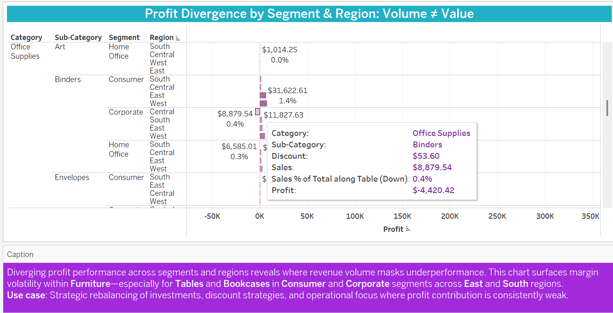
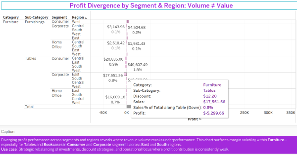
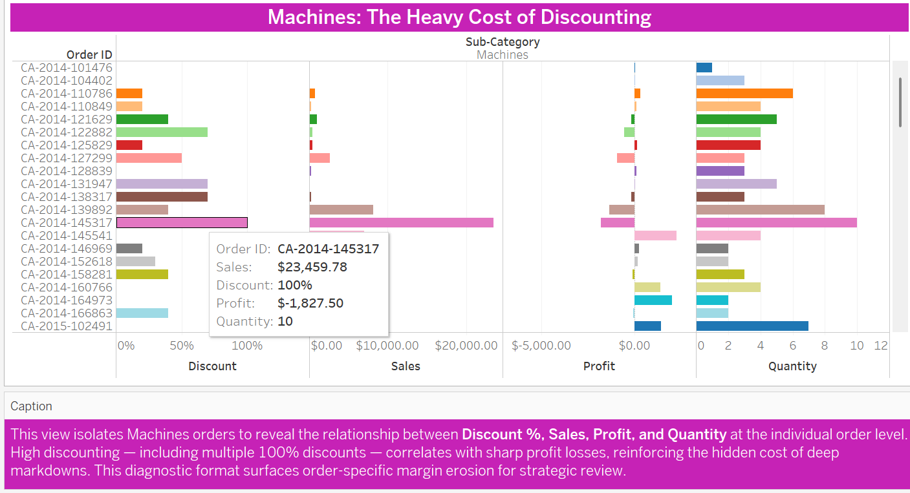

# 📊 Diagnostic Profitability Framework  
**Filename:** `Diagnostic_Profitability_Framework.md`  
**Insight Theme:** *Top Sellers, Bottom Margins: Diagnosing Profit Erosion in High-Volume Segments*

---

## 🟪 Brief Summary

This insight uncovers a consistent disconnect between sales volume and profitability across several product segments in the Superstore dataset. While categories like **Phones**, **Machines**, and **Tables** contribute heavily to top-line revenue, they deliver **surprisingly low or negative profits**.  

By layering **discount rates**, **segment performance**, and **category-level profit margins**, this diagnostic analysis exposes where **margin erosion is quietly undermining performance**—despite what surface-level sales reports suggest.

---

## 🟦 Purpose of the Insight

To diagnose where **sales volume masks weak profit contribution**, enabling sharper business decisions around:

- Product prioritization and inventory mix  
- Strategic discount policies  
- Segment and region-specific profitability  
- Data storytelling that goes beyond revenue optics  

This insight reframes executive performance reviews from “sales-centric” to **margin-conscious** and lays the foundation for smarter allocation and pricing strategy.

---

## 🟦 Key Business Questions Answered

- Which high-revenue products are failing to generate healthy profits?  
- Where are discounting practices eroding margins the most?  
- Are there differences by **region**, **segment**, or **category** that indicate hidden risk?  
- Where are the **high-margin winners** that deserve more strategic focus?  
- How can BI tools be used to surface these issues before they become structural problems?

---

## 🟩 How the 5 Whys Unlocked Strategic Clarity

**Observation:** Machines & Phones are high-volume sellers—but underperform on profit.

> **Why do high-revenue categories underperform on margin?**

✅ **1st Why:** Because **discounting is disproportionately high**, especially in the Consumer segment.  
✅ **2nd Why:** Because they’re part of **highly competitive, price-sensitive categories**.  
✅ **3rd Why:** Because businesses may **prioritize market share or revenue optics** over profitability.  
✅ **4th Why:** Because most reporting **doesn’t tie margin erosion to order-level or segment-level discount behaviors**.  
✅ **5th Why:** Because dashboards often **don’t integrate margin, discount %, and profit-to-sales ratio in one place.**

---

## 🟪 Analyst Note on Discount Logic

In the Superstore dataset, `Discount` is expressed as a **percentage value per transaction line**, not a dollar figure. For example, two rows showing a discount of `0.50` under the same `Order ID` means **each line received a 50% discount**, not that a full 100% discount was applied.  

> Tableau sums discounts **per row**, not per order. This can create misleading visuals unless analysts carefully interpret the data structure.

---

## 📊 Featured Visuals

🟩 **Treemap – Sales vs. Profit by Category & Sub-Category**  

🟨 **Segment-Level Diverging Bar Chart – Profit Divergence**  

🟪 **Heatmap – Profit & Discount Variance by Category/Subcategory**  
  
  

🟧 **Machines Focus Visual – Discounting Deep Dive**  

---

## Final Reflection

> “Not all top sellers are top earners.”  

This diagnostic insight challenges the reflex to focus on sales leaders and instead **surfaces where margin risk quietly lives**. By combining visual and analytical techniques, this analysis enables leaders to stop chasing volume alone—and instead optimize based on **contribution, not just conversion.**

---

