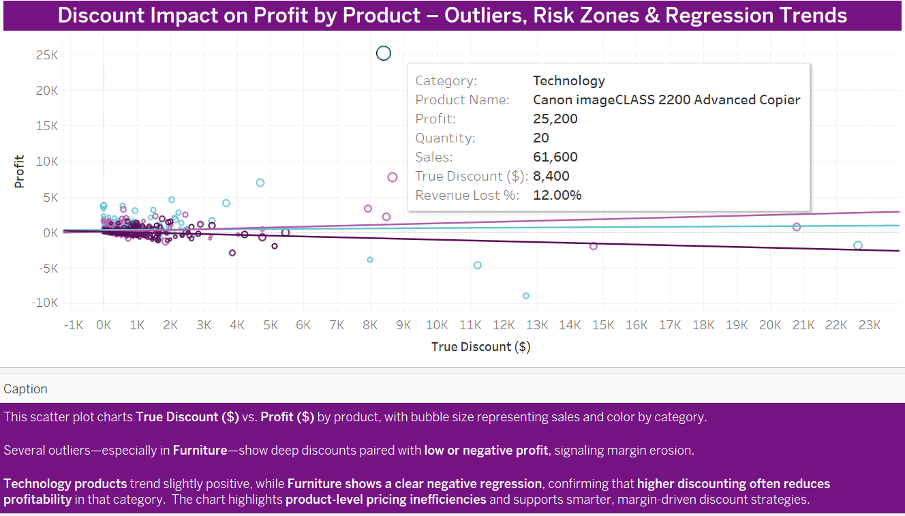
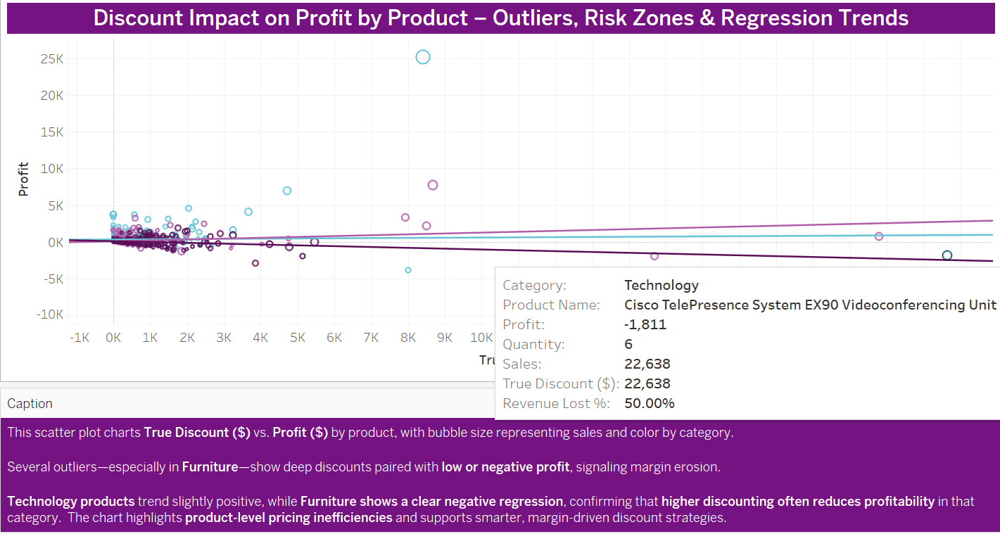
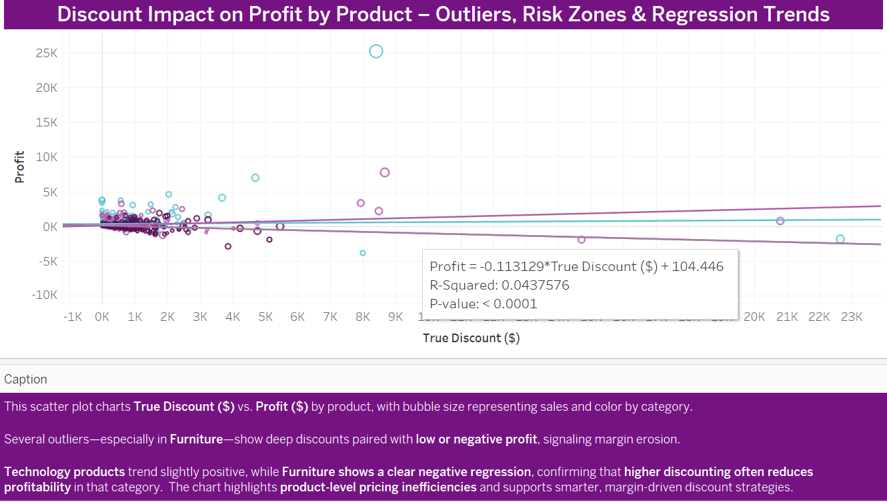
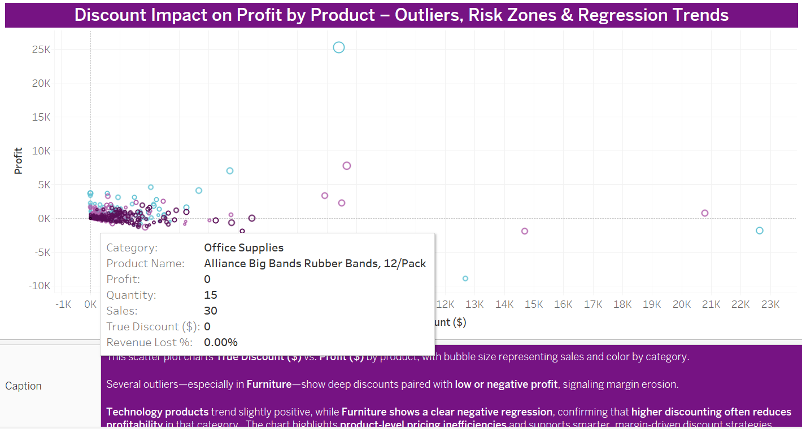

## 🟪 Discount Impact on Profit by Product – Outliers, Risk Zones & Regression Trends

This scatter plot charts **True Discount ($)** against **Profit ($)** by product.  
- **Bubble Size:** Total Sales  
- **Color:** Product Category (Furniture, Office Supplies, Technology)  
- **Trendlines:** Category-specific linear regressions  

---

### 🟩 Key Insights

- **Furniture** exhibits a **negative regression slope**, indicating that **higher discounts correlate with lower profits**.  
- Multiple Furniture products fall into **high-discount, low-profit zones**, reinforcing discount erosion concerns.
- **Technology** shows a slightly **positive trend**, suggesting some discounts may support strategic bundling or high-margin sales.  
- **Office Supplies** exhibits **minimal correlation**, but certain products (e.g., Binding Systems) show revenue loss at mid-tier discounts.

> One outlier—**Cubify CubeX 3D Printer**—had a 46.98% revenue loss on just $11K in sales, reinforcing the **margin-risk zone**.

> **Alliance Rubber Bands** anchor the neutral zone: 0% profit, 0% discount—a helpful baseline.

---

### 🟪 Regression Trendlines (Per Category)

- **Furniture:** `y = -0.113129x + 104.446`  
  - **R² = 0.043**, **P < 0.0001** → Statistically significant  
- **Technology:** `y = 0.0261138x + 340.437`  
  - **R² = 0.0007**, **P = 0.5869** → Not significant  
- **Office Supplies:** `y = 0.117217x + 97.1322`  
  - **R² = 0.0829**, **P < 0.0001** → Statistically significant

---

### 🟦  Interpretation

- **Furniture's negative slope confirms discounting is hurting profitability.**  
- While **Technology’s trend is weak**, the **high-margin Canon Copier** outlier supports smart discount use.  
- **Office Supplies** straddle the line—neither harmed nor significantly helped by discounts—suggesting **selective discounting may be key.**

---

### Visual Reference (Static Export)

  
> Canon & Cisco represent Technology’s positive/negative contrast  
  
  

📊 **Furniture Regression Snapshot**  
 

📊 **Office Supplies Example: Rubber Bands (Neutral Zone)**  

---
