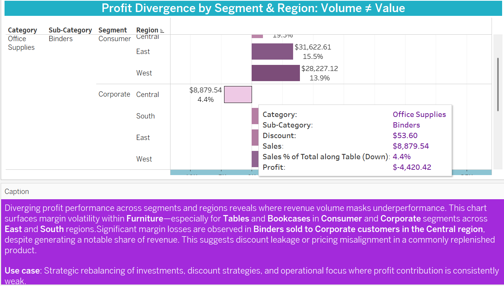

# Profit Divergence Analysis  
**Filename:** `Profit_Divergence_Analysis.md`  
**Insight Theme:** *Volume ≠ Value: Revealing Hidden Margin Losses Across Segments*

---

## 🟦 Summary

This insight explores where **strong revenue performance masks weak profitability** by analyzing profit divergence across **Segment × Region × Sub-Category** combinations. The visual diagnostic unpacks granular performance patterns to expose products and regions where revenue does not equal value.

---

## 🟩 Purpose of the Insight

To identify underperforming areas where **high-volume sales are not matched by proportional profits**, enabling:

- Root cause diagnostics of **margin leakage**
- Region-specific strategy refinement
- Improved inventory, promotion, and pricing decisions

---

## 🟪 Key Business Questions Answered

1. Which Segment–Region combinations consistently erode profit?
2. Are high-volume categories delivering contribution returns?
3. Where is revenue masking discount inefficiencies?
4. What patterns emerge in margin underperformance by product line?

---

## 🟢 Insight Narrative: Segment–Region Divergence

This view reveals how **aggregated sales metrics can conceal profit performance gaps**, especially in certain **furniture and office supply segments**. By layering **Sales, Profit, Discount, and Profit Margin %**, we detect divergence zones that warrant attention:

---

### 🟩 Segment-Level Divergence  

- **Tables and Bookcases** underperform in **Consumer** and **Corporate** segments across the **South and East regions** despite strong sales.
- **Machines** reflect persistently low profit margins, suggesting pricing or cost structure issues even at modest sales volumes.
- **Binders** present a stealth risk—generating revenue but **sustaining losses in Corporate/Central**.

---

### 🟪 Regional Heatmap Breakdowns  

**🟡 Corporate | Central**  

**🟡 Home Office | West**  

**🟡 Corporate | East**  

These heatmaps reveal **low-margin concentrations** in specific Sub-Categories (e.g., **Tables**, **Bookcases**, **Machines**) that were previously overlooked due to blended profit metrics.

---

### 🟦 Binders – Corporate Segment Insight  

> Significant margin losses are observed in **Binders sold to Corporate customers in the Central region**, despite generating a notable share of revenue. This suggests discount leakage or pricing misalignment in a commonly replenished product.

---

## 🟩 Why It Matters

> Leadership teams often focus on sales volume to define success, but **revenue ≠ value**.  
> Divergence visuals reveal blind spots in profitability that typical KPI dashboards miss.

Without margin-led visibility, decision-makers risk:

- Rewarding revenue without contribution  
- Overcompensating sales teams for unprofitable deals  
- Misallocating resources to regions with hidden losses  
- Allowing discounting to become a structural drag on net income  

This insight reframes performance conversations away from top-line focus and toward **sustainable margin health** — because **value ≠ volume** unless both are measured together.

**Strategic Use Cases:**

- 🟦 **Inventory Rebalancing:** Redirect investments away from persistently loss-making combinations  
- 🟪 **Promotion Adjustment:** Avoid blanket discounts; tailor by region and segment  
- 🟩 **Profit Forecasting:** Use divergence trends as early warning signals for performance slippage

---

## 🟣 Analyst Note: Pattern Recognition from Root Cause Logic

> The insight connects back to root-cause themes in the Diagnostic Profitability Framework. Many of the worst-performing combinations in this analysis reflect the **same categories flagged by 5 Whys diagnostics** — reinforcing the idea that margin erosion is not isolated, but **structurally embedded across regions and segments**.

---
---

## 🧠 Analyst Note: Pattern Recognition from Root Cause Logic

This insight connects back to root-cause themes identified in the 
[🟪 Diagnostic Profitability Framework](../Insights/Diagnostic_Profitability_Framework.md).  
Many of the worst-performing segment-category combinations reflect the same erosion points flagged by **5 Whys** — reinforcing that margin breakdown is not isolated, but structurally embedded across segment-region intersections.

---

## 📁 Related Strategic Recommendations

[🟪 Diagnostic Profitability Recommendations](/Strategic_Recommendations/diagnostic_profitability_recommendation.md)   
[🟨 Strategic Response – Profit Divergence](/Strategic_Recommendations/profit_divergence_recommendation.md)

---
