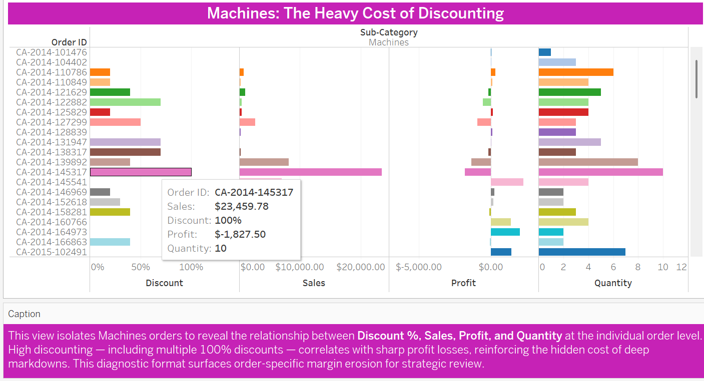
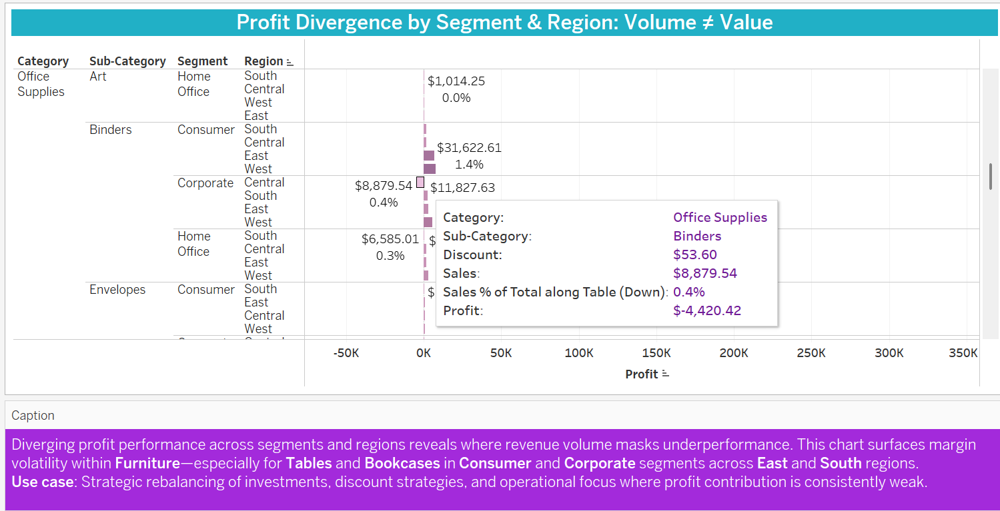
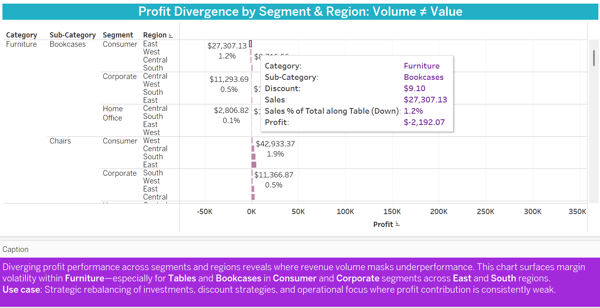

# 🟢 Profit Divergence Analysis  
**Filename:** `Profit_Divergence_Analysis.md`  
**Insight Theme:** *“Volume ≠ Value: The Margin Mirage in High-Sales Regions”*

---

## 🟦 Brief Summary

This insight exposes how strong sales volume **can mask poor profit performance**, especially across specific segment-region combinations. By analyzing diverging bar charts and targeted heatmaps, we uncover **systemic margin leakage** in categories that appear healthy at first glance — but are quietly undercutting business performance due to aggressive discounting and cost inefficiencies.

---

## 🟩 Purpose of the Insight

To identify **which products, regions, and segments** are contributing **less profit than expected relative to their sales**, guiding better decisions around:

- Pricing model reform  
- Regional investment strategy  
- Sales compensation alignment  
- Operational or procurement cost reviews  

---

## 🟪 Key Business Questions

1. Which segment-region combinations are leaking margin despite strong revenue?  
2. Are certain product categories more vulnerable to underperformance in specific geographies?  
3. How does discounting intersect with profitability at a regional level?  
4. What patterns indicate operational inefficiency vs. strategic pricing decisions?

---

## Diagnostic Narrative

Leadership often celebrates high sales volume — but without profit visibility, that success may be **illusory**.

This analysis drills into combinations of **Segment × Region** to assess **Profit vs. Sales**. Using diverging bar charts and layered heatmaps, it becomes clear that:

- 🟦 **Tables and Bookcases** underperform in **Consumer and Corporate segments** across **East and South** regions.  
- 🟩 **Machines** show widespread erosion across all segments, often with **100% discounting** (see companion insight: [Diagnostic Profitability Framework](../docs/insights/Diagnostic_Profitability_Framework.md)).  
- 🟪 **Binders** are heavily discounted and frequently sold, yet yield **consistently negative profit**, especially in the **South region**.

These patterns suggest a deeper problem in how **discounting strategies**, **regional targeting**, and **cost structures** align with sales performance.

---

## 🟣 Analyst Note: Pattern Recognition from Root Cause Logic

The insight connects back to root-cause themes in the Diagnostic Profitability Framework. Many of the worst-performing combinations in this analysis reflect the **same categories flagged by 5 Whys diagnostics** — reinforcing the idea that margin erosion is not isolated, but **structurally embedded across regions and segments**.

---

## Featured Visuals

### 🟪 Machines – The Heavy Cost of Discounting  

### 🔵 Profit Divergence: Segment x Region  

### 🟡 Heatmap: Corporate | Central  

### 🟡 Heatmap: Home Office | West  

### 🟡 Heatmap: Corporate | East  

---

## 🟪 Why It Matters

Without margin-led visibility, decision-makers risk:

- Rewarding revenue without contribution  
- Overcompensating sales teams for unprofitable deals  
- Misallocating resources to regions with hidden losses  
- Allowing discounting to become a structural drag on net income  

This insight reframes performance conversations away from top-line focus and toward **sustainable margin health** — because **value ≠ volume** unless both are measured together.

---

## 🔗 Related Insight

📄 [Diagnostic Profitability Framework](../docs/insights/Diagnostic_Profitability_Framework.md)
