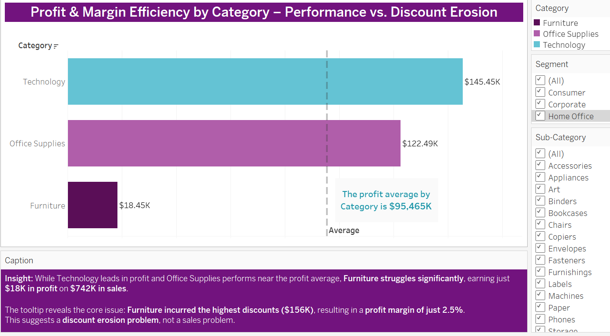

# Profit & Margin Efficiency by Category – Performance vs. Discount Erosion

> **Note:** This view includes slicers for Segment and Sub-Category to demonstrate interactivity in Tableau. Static images shown for GitHub documentation.

---

## 🟩 Insight Summary

This analysis evaluates profit performance and margin efficiency across three main product categories — **Technology**, **Office Supplies**, and **Furniture** — through the lens of sales, profit, margin %, and true discount ($). The insight centers on understanding not just who leads in raw profitability, but which categories are operationally efficient and where performance is compromised by discounting behavior.

---

### 🟦 Technology – The Top Performer

- **Profit:** $145,455  
- **Sales:** $836,154  
- **Profit Margin:** 17.4%  
- **True Discount:** $127,515  

Technology leads all categories in both raw profit and margin efficiency. With a profit 50% above the average and discounts under control, this category reflects a well-balanced margin-focused sales strategy.

---

### 🟪 Office Supplies – Stable Performance

- **Profit:** $122,491  
- **Sales:** $719,047  
- **Profit Margin:** 17.0%  
- **True Discount:** $134,204  

Office Supplies lands close to the category profit average ($95,465) while maintaining margin integrity despite discount levels comparable to Technology. It reflects operational steadiness with minor margin dilution.

---

### 🟫 Furniture – Low Profit, High Discount

- **Profit:** $18,451  
- **Sales:** $742,000  
- **Profit Margin:** 2.5%  
- **True Discount:** $156,221  

Despite robust sales, Furniture barely returns profit. Its **profit margin of just 2.5%** and the **highest discounts across all categories** suggest a deeper operational issue.

> **Furniture doesn’t have a sales problem — it has a discount erosion problem.**  
> Excessive discounting is cannibalizing profit margins, signaling a need for margin-preservation strategy over revenue-first tactics.

---

### 🔵 Visual Reference (Static Export)

> The vertical dashed line represents the average category profit of **$95,465**.

---

### 🔗 Related Strategic Recommendation:
📄 [Profit_Divergence_Recommendations.md](../../Strategic_Recommendations/Profit_Divergence_Recommendations.md)

