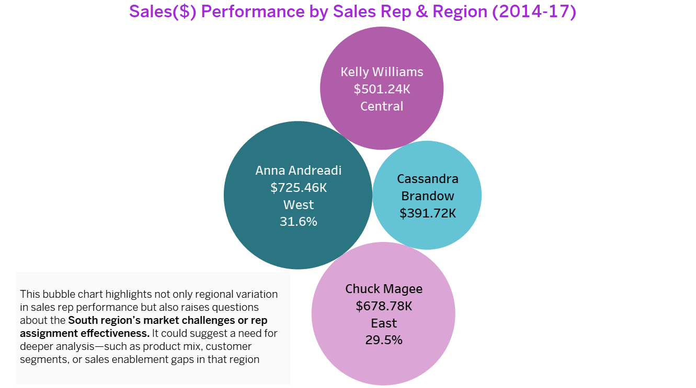

```markdown
# 📊 Sales Rep & Regional Sales Performance Analysis

This insight explores **individual sales performance** by region across the Superstore dataset (2014–2017), blending regional sales patterns with rep-level outcomes. 

The analysis is supported by two key visualizations:
- **Bubble Chart**: Sales Rep Performance by Region (Sales & % of Total)
- **Map Visualization**: Geographic Distribution of Sales Rep Coverage & Results

---

## 🌍 Visual 1: Sales Rep Regional Map


**Insight:**
> Sales are **highest in the West**, managed by **Anna Andreadi**, while **Cassandra Brandow** in the **South** manages the lowest-revenue region. 
> This map reveals the **geographic distribution of sales reps**, highlighting sharp contrasts in regional performance.

---

## 📊 Visual 2: Sales Rep Performance by Region (% of Total)


### Breakdown:
| Sales Rep           | Region  | Total Sales     | % of Total |
|---------------------|---------|------------------|------------|
| Anna Andreadi       | West    | $725.46K         | 31.6%      |
| Chuck Magee         | East    | $678.78K         | 29.5%      |
| Kelly Williams      | Central | $501.24K         | 21.8%      |
| Cassandra Brandow   | South   | $391.72K         | 17.1%      |

---

### 🔑 Key Observations
- **West Region dominates** in overall sales and has the top-performing sales rep.
- **South Region lags** significantly behind the other three, raising questions.

---

## 🧐 Analyst Reflection: South Region as a Strategic Inquiry

This insight sparked several **hypothesis-driven questions** around Cassandra Brandow's underperformance:

- ✉️ *Market Potential:* Is the **South region's market smaller**, or underserved?
- ✉️ *Product Alignment:* Do product offerings align with regional demand?
- ✉️ *Customer Segments:* Are **high-value customer segments** (e.g., Corporate, Home Office) less present?
- ✉️ *Sales Enablement:* Is the sales rep fully supported with enablement tools, promotions, and support?
- ✉️ *Return Trends:* Could **higher return rates** be offsetting new sales gains?

---

## 🔬 Connecting to Previous Insight: Monthly Sales Trend
In the earlier **South Region line chart**, we saw:
- A **low R-squared (0.026)**
- A **non-significant p-value (> 0.27)**
- High sales **volatility with no clear trend**

This lends quantitative support to the idea that Cassandra Brandow may be facing **structural or market-based challenges** in her region.

---

## 🚀 Final Thought
This is more than just a leaderboard. The sales rep analysis opens up a **diagnostic lens** on market allocation, sales enablement, and territory management. 

> “Where performance lags, data-driven questions should lead.”

---

## 🔹 Next Steps (Optional Analysis Ideas)
- Drill-down by **Product Category** within each region
- Analyze **Customer Segments** per region
- Compare **Return Rates** per sales rep or region
- Assess **YoY sales per rep** to track momentum or stagnation

---

**Filename:** `Sales_Rep_Regional_Performance.md`
**Folder:** `/docs/Insights/`  
**Visuals Used:**
- `Sales_Rep_Regional_Map.png`
- `Sales_Rep_Performance_By_Region.png`
```

