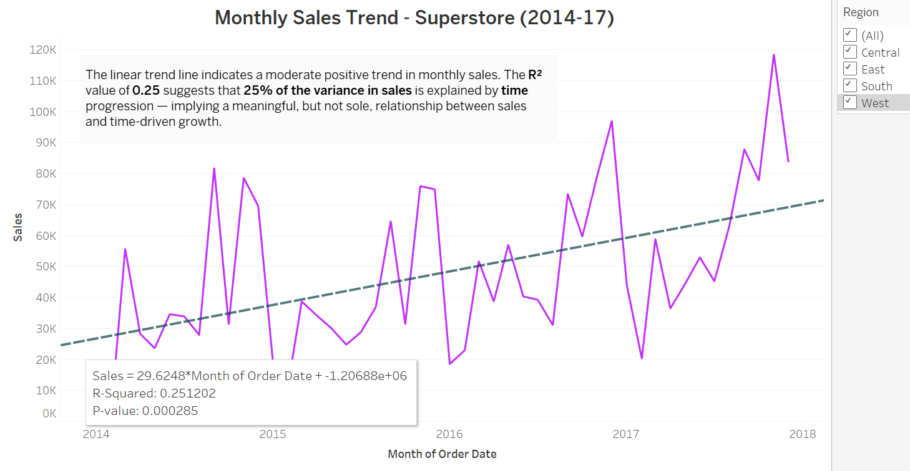
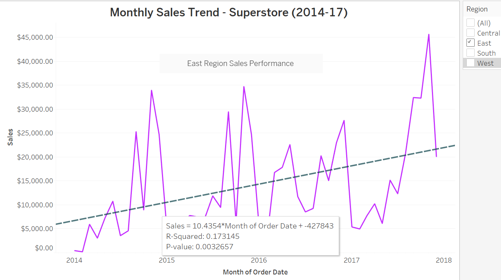

# 📈 Monthly Sales Trend Analysis – Superstore (2014–2017)

This analysis investigates monthly sales trends across the Superstore dataset between 2014 and 2017. Using linear regression trendlines, we examine how sales have changed over time, both overall and within each U.S. region.

By layering **R² values and p-values** onto each visualization, we introduce a **diagnostic modeling lens** to better understand the strength of time-based growth in different territories.

---

## Overall Monthly Sales Trend (All Regions)

- 📈 **Regression Equation**: Sales = 29.62 × Month – 1,206,880  
- **R² = 0.25** → 25% of sales variation explained by time  
- **p-value = 0.000285** → Statistically significant trend

> **Interpretation**: There is a moderate positive trend in monthly sales across all regions, suggesting meaningful (but not sole) growth linked to time.

---

## 📍 Central Region

- **R² = 0.13** → Weak time relationship
- **p-value = 0.0126** → Statistically significant, but limited predictive value
- Peak: $34K in Sept 2014

> **Central has inconsistent growth with occasional high spikes.** Trendline indicates slight improvement, but variability suggests external factors at play (e.g., promotions, limited market penetration, or sales rep inconsistency).

---

## 📍 East Region

- **R² = 0.17**
- **p-value = 0.0033**
- Peak: $45K in Nov 2017

> **East shows a clearer trend upward**, though still with moderate noise. There's opportunity here for **forecasting improvements** and **sales planning** using this directional growth.

---

## 📍 South Region

- **R² = 0.03**
- **p-value = 0.27** (not statistically significant)
- Peak: $32K in Mar 2014

> **South is the weakest performing region** from a trend perspective. Very little of the sales growth is time-driven, signaling issues with market engagement, consistency, or possibly a need for better territory optimization.

---

## 📍 West Region

- **R² = 0.31**
- **p-value < 0.0001**
- Peak: $33K in Dec 2016

> **West is the strongest performer.** Clear positive trend with statistically significant growth over time. Indicates a well-managed territory, consistent customer base, or successful marketing strategy.

---

## 💬 Business Questions This Analysis Helps Answer:

- Are we consistently growing over time?
- Which regions are contributing most to time-driven growth?
- Where should we **reallocate resources, coaching, or strategy**?
- Can we use trend direction to inform future **sales forecasting** or **incentive planning**?

---

## 🧠 Analyst Commentary

> “This wasn’t just about plotting sales over time — it was about *understanding the nature of growth* and using that to inform better decision-making. The South’s weak trend shocked me the most. It raised questions about sales rep engagement, territory potential, or customer loyalty — all of which point toward strategic investigation.”

---

## ✅ Strategic Recommendation

- 🔹 **South Region**: Investigate further – consider sales rep training, territory realignment, or marketing interventions.
- 🔹 **West Region**: Leverage as a model – explore what's driving consistent growth.
- 🔹 **Use regression trend modeling** for future business planning and performance benchmarking.

---

📂 _Saved in `/Assets/`  
Linked from_ `/docs/Insights/monthly_sales_trend_analysis.md`
